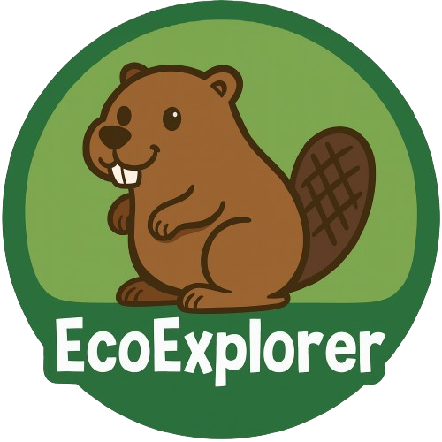

# EcoExplorer

EcoExplorer is a web application for 12-year-old users, developed as an extension of Natuurmonumenten/OERRR. The
application focuses on completing nature-related challenges with a clear step-by-step structure and multiple difficulty
levels. After completing a challenge, users upload a photo as proof, which is then reviewed and approved by a parent or
guardian via email.

Once approved, users earn badges that contribute to their rank progression. Higher ranks unlock additional features,
such as creating and sharing their own challenges. EcoExplorer uses gamification elements badges, ranks, and challenges
to motivate users, increase engagement, and build an active community around nature and outdoor activities.

##📋 Table of Contents

- [🗺️ Entity Relationship Diagram](#-entity-relationship-diagram)
- [🎯 Project Goals](#-project-goals)
- [🧠 Core Concept & Functionality](#-core-concept--functionality)
- [🚀 Technologies Used](#-technologies-used)
- [🔐 Privacy & AVG (GDPR) Considerations](#-privacy--avg-gdpr-considerations)
- [🔧 Installation & Setup](#-installation--setup)
- [🚢 Deployment Notes](#-deployment-notes)
- [🔮 Future Improvements](#-future-improvements)
- [⚠️ Edge Cases & Considerations](#-edge-cases--considerations)
- [📄 Disclaimer](#-disclaimer)

## 🗺️ Entity Relationship Diagram

```mermaid
erDiagram
    USERS {
        bigint id PK
        varchar name
        varchar email
        varchar password
        boolean is_admin
        int rank
    }

    CHALLENGES {
        bigint id PK
        varchar title
        longtext description
        boolean published
        time duration
        bigint user_id FK
        bigint difficulty_id FK
        bigint badge_id FK
        timestamp timestamp_created
        timestamp timestamp_edited
    }

    STEPS {
        bigint id PK
        int step_number
        longtext step_description
        bigint challenge_id FK
    }

    DIFFICULTIES {
        bigint id PK
        varchar difficulty
    }

    SUBMITTED {
        bigint id PK
        bigint user_id FK
        bigint challenge_id FK
        blob content
        boolean pending
        bigint date
    }

    USER_CHALLENGE {
        bigint id_user FK
        varchar challenge_id FK
    }

    CHALLENGE_COMPLETED {
        bigint id_user FK
        varchar challenge_id FK
        datetime completed_at
    }

    BADGES {
        bigint id PK
        blob image
        varchar name
        longtext description
    }

    BADGE_USER {
        bigint id_badge FK
        bigint user_id FK
        datetime acquire
    }

    USERS ||--o{ CHALLENGES: creates
    USERS ||--o{ SUBMITTED: submits
    CHALLENGES ||--o{ SUBMITTED: receives
    CHALLENGES ||--o{ STEPS: has
    DIFFICULTIES ||--o{ CHALLENGES: categorizes
    USERS }o--o{ BADGES: earns
    USERS }o--o{ CHALLENGES: participates
  ````

## 🎯 Project Goals

- Increase awareness and engagement with nature among young users
- Use gamification (badges, ranks, challenges) to stimulate motivation
- Encourage community interaction through user-created challenges
- Prepare users for long-term, self-driven involvement with Natuurmonumenten

## 🧠 Core Concept & Functionality

- EcoExplorer revolves around completing nature-related challenges:
- Users can browse challenges with different difficulty levels (Easy, Medium, Hard)
- Most challenges contains a step-by-step guide
- After completion, users upload a photo as proof
- Proof is reviewed by a parent or guardian via email
- Upon approval, users receive a badge
- Badges increase the user’s rank
- Higher ranks unlock the ability to create and share challenges
- This structure supports both intrinsic and extrinsic motivation while keeping the platform safe and compliant with
  privacy regulations.

## 🚀 Technologies Used

- Frontend: Tailwind CSS, JS
- Backend: PHP with Laravel Framework
- Database: sqlite
- Email Handling: Mailgun API [See Api](https://github.com/mailgun/mailgun-php)
- Version Control: Git & GitHub

## 🔐 Privacy & AVG (GDPR) Considerations

- Due to GDPR regulations:
- Minimal user data is stored
- No analytical tracking of underage users is performed
- Challenge validation is handled by parents/guardians

## 🔧 Installation & Setup

Prerequisites

- Laravel Herd installed
- PHP 8.1 or higher

Setup

```bash
git clone https://github.com/Tooya-Igarashi/tle2.git
cd tle2
composer install
npm install
````

Environment Configuration

````bash
cp .env.example .env
php artisan key:generate
````

Configure your database credentials in the .env file.

Database Migration

````bash
php artisan migrate:fresh --seed
````

Install Mailgun Install

```bash
composer require guzzlehttp/guzzle
composer require symfony/mailgun-mailer
composer require symfony/http-client
composer require symfony/mailgun-mailer mailgun/mailgun-php
````

Mailgun Configuration in .env

````bash
MAIL_MAILER=mailgun
MAILGUN_DOMAIN=your-mailgun-domain
MAILGUN_SECRET=your-mailgun-secret-key
MAILGUN_ENDPOINT=api.mailgun.net
MAIL_FROM_ADDRESS="Your@site.com"
MAIL_FROM_NAME="Your Site Name"
````

Running the Application

When using Laravel Herd, the application is automatically served.
Open the project using the domain assigned by Herd, for example:

````bash
https://tle2.test
````

## 🚢 Deployment Notes

- Ensure correct environment variables are set (APP_ENV, APP_KEY, DB_*)
- Use a secure mail service for parental approval emails
- Storage and file permissions must allow image uploads
- For more details, refer
  to [the this github repository.](https://github.com/HR-CMGT/PRG05-2025-2026/tree/main/deployment-tle)
- Storage needs to be linked using:

````bash
php artisan storage:link
````

## 🔮 Future Improvements

- Alternative approval methods besides email
- Automated content moderation
- Video tutorials instead of static images
- Expanded community features

## ⚠️ Edge Cases & Considerations

- Photo rejection:
  If a submission is rejected, the user can redo the challenge and upload a new photo
- No parental response:
  Submissions remain pending until approved or rejected
- Incomplete challenges:
  Badges and rank progression are only awarded after approval
- Scalability:
  Future automation (e.g. content validation scripts) can reduce admin workload
- Mail deliverability:
  Ensure emails reach parents/guardians by using a reliable mail service and proper email formatting
- Token based approval links:
  Use secure, unique tokens in approval/rejection links to prevent unauthorized actions

## 📄 Disclaimer

This project was developed as an educational prototype. Certain features (such as automated moderation) are conceptual
and intended for future development.

